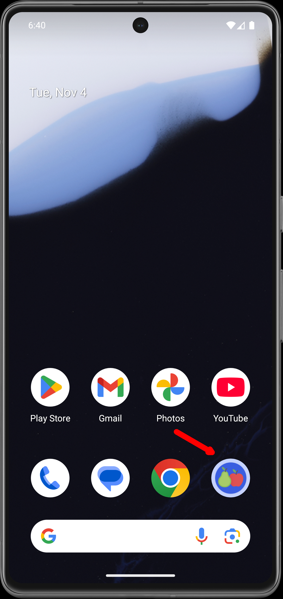
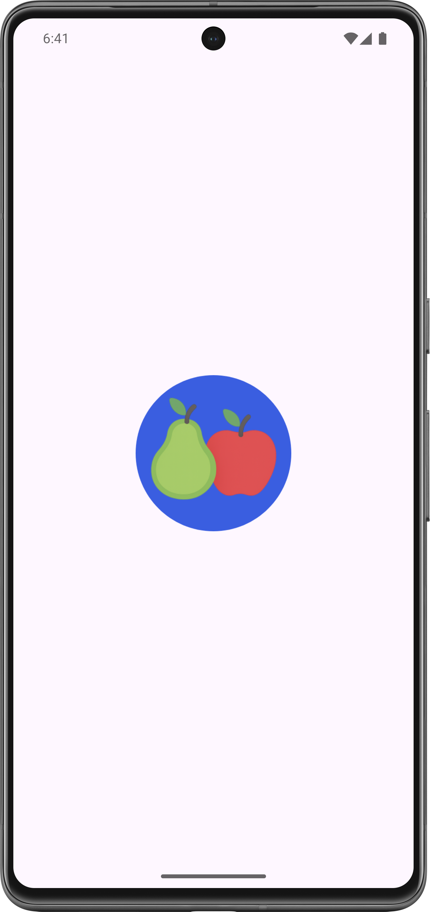
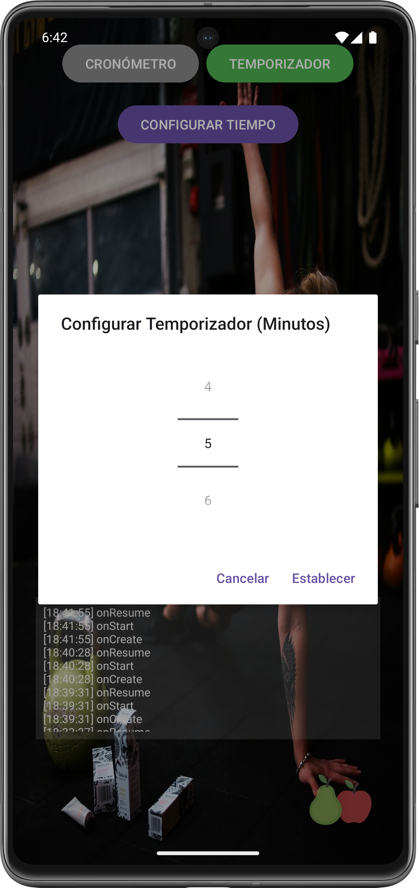

# 🚀 MOD6 AE1-ABPRO1: Temporizador para Gimanasio (MVVM + Room)

<p float="center">
  
</p>

Aplicación nativa para Android, desarrollada en Kotlin, diseñada para funcionar como una herramienta dual: **Temporizador (Count Down Timer)** y **Cronómetro (Stopwatch)** , enfocada para ser usada por deportistas en entornos de entrenamiento y gimnasio. La arquitectura se basa en el patrón Model-View-ViewModel (MVVM), y la persistencia de datos utiliza la librería Room para registrar los eventos del ciclo de vida de la aplicación, lo que además se muestran por pantalla en una ventana de tipo "Scroll".

El objetivo principal ha sido el demostrar la integración de los componentes de Android Jetpack para crear una aplicación robusta, separando la lógica de negocio de la UI, asegurando escalabilidad y reactividad mediante LiveData y Kotlin Coroutines.

---

## 🎯 Requerimientos de Funcionalidad y su Implementación

| Requerimiento                           | Implementación en V5                                                                                                                                                       |
| --------------------------------------- | -------------------------------------------------------------------------------------------------------------------------------------------------------------------------- |
| 1. Modos de Operación (Timer/Stopwatch) | Dos botones permiten alternar entre el**Modo Cronómetro** (cuenta progresiva) y el **Modo Temporizador** (cuenta regresiva).                                               |
| 2. Configuración del Temporizador       | En modo Temporizador, se habilita el botón**"CONFIGURAR TIEMPO"** que abre un diálogo con un `NumberPicker` para establecer los minutos iniciales.                         |
| 3. Registro de Auditoría (Logs)         | Los eventos principales del ciclo de vida de la `MainActivity` (`onCreate`, `onStart`, `onResume`, `onPause`, `onStop`, `onDestroy`) se registran automáticamente en Room. |
| 4. Visualización Reactiva de Logs       | Un `ScrollView` dedicado en el `activity_main.xml` muestra la lista de eventos de auditoría (logs), actualizándose en tiempo real mediante `LiveData`.                     |

---

## 🧠 Arquitectura y Tecnología: MVVM y Jetpack

Se implementa el patrón MVVM (Model-View-ViewModel) para garantizar una arquitectura limpia, mantenible y escalable, utilizando los componentes de Android Jetpack.

1. Modelo (Model) y Persistencia (Room)

| Componente                          | Descripción                                                                                                                            |
| ----------------------------------- | -------------------------------------------------------------------------------------------------------------------------------------- |
| Modelo de Datos (LogEventEntity.kt) | Clase de datos que define la estructura del registro de auditoría (ID, Evento de Ciclo de Vida, Fecha y Hora).                         |
| Database (AppDatabase.kt)           | Clase abstracta que gestiona la base de datos Room y la instancia única del DAO.                                                       |
| DAO (LogEventDao.kt)                | Interfaz que define las operaciones de persistencia (@Insert, @Query) y expone la lista de logs como `LiveData<List<LogEventEntity>>`. |
| Repositorio (LogEventRepository.kt) | Centraliza el acceso a los datos (LogEventDao), encapsulando la lógica de I/O dentro de funciones `suspend` (Kotlin Coroutines).       |

- Hereda de `ViewModel`.
- Utiliza `viewModelScope.launch` para ejecutar las operaciones del Repository de forma asíncrona (I/O o E/S).
- **Lógica de Temporización** : Implementa la lógica para manejar el contador de tiempo (iniciar, pausar, detener) y el _tictac_ que se produce cada segundo.
- **Auditoría de Logs** : Contiene el método `insertLog(evento: String)` que llama al repositorio para persistir el evento del ciclo de vida.
- Expone el estado de la aplicación a la Vista a través de `LiveData`:
  - `timerDisplay`: El tiempo actual del temporizador/cronómetro (formato HH:MM:SS) para actualizar la UI.
  - `isTimerRunning`: Estado booleano que determina si el contador está en movimiento.
  - `allEvents`: Lista de todos los eventos de auditoría que alimenta el `ScrollView` de forma reactiva.

3. Vista (View) - MainActivity.kt

- Es el contenedor principal de la aplicación.
- **Orquestación** : Inicializa el `TimerViewModel` y el `LogEventRepository`.
- **Registro del Ciclo de Vida** : Implementa las funciones de _callback_ del ciclo de vida (`onStart`, `onResume`, etc.) para llamar a `viewModel.insertLog(...)` en cada cambio de estado.
- **Interacción con UI** :
  - Gestiona los listeners de los botones (Iniciar/Pausar, Reset, Configurar).
  - **Observación Reactiva** : Observa `viewModel.timerDisplay` para actualizar el TextView principal del contador y `viewModel.allEvents` para actualizar el `ScrollView` del historial de _logs_ de forma reactiva.
  - **Gestión de Estados** : Utiliza `viewModel.isTimerRunning` para cambiar el texto y la funcionalidad del botón Iniciar/Pausar.

## ✨ Reactividad y Flujo de Datos

El flujo de datos está diseñado para ser completamente reactivo, especialmente en el registro de la auditoría de ciclo de vida:

1. Disparo del Evento: En un cambio de estado del ciclo de vida (ej. `onPause()`), la **MainActivity** llama a `viewModel.insertLog("PAUSE")`.
2. Persistencia Asíncrona: El **ViewModel** utiliza `viewModelScope.launch` para llamar a `repository.insertLog(...)`, el cual ejecuta la operación de **INSERT** en el **DAO** de Room, fuera del hilo principal.
3. Actualización de LiveData: La consulta `getAllEvents()` del **_DAO_** retorna un **LiveData** . Cuando Room confirma el nuevo INSERT, el LiveData se dispara automáticamente.
4. Sincronización de UI: El observador en **MainActivity** detecta el cambio en `viewModel.allEvents` y actualiza el contenido del `ScrollView` para mostrar el nuevo log, manteniendo un registro en tiempo real.

## 🛠️ Tecnologías usadas

- **IDE** : Android Studio
- **Plataforma** : Android Nativo
- **Lenguaje** : Kotlin (1.9.22)
- **Arquitectura** : MVVM (Model-View-ViewModel).
- **Persistencia** : Room Database (SQL Abstraction).
- **Concurrencia** : Kotlin Coroutines y `viewModelScope` (Dispatchers.IO).
- **Comunicación** : LiveData (Reactividad) y View Binding.

---

## 🏗️ Funcionamiento de la Aplicación

El flujo de la aplicación se centra en la operación del contador y la auditoría automática:

1. Inicio y Modo: La aplicación inicia en la `MainActivity` y por defecto en el **Modo Temporizador** . Se muestra el botón "CONFIGURAR TIEMPO", y este lanza un spinner de minutos (1-60), se excluyeron los segundos.
2. Interacción del Contador:
   - El usuario presiona **"INICIAR"** : El `TimerViewModel` comienza el `Timer` interno que actualiza `timerDisplay` cada segundo. El botón cambia a "PAUSAR".
   - El usuario presiona **"PAUSAR"** : Se ocultan los otros botones. El contador se detiene.
   - El usuario presiona **"RESET"** : El contador vuelve a 00:00:00.
3. Cambio de Modo: Si el usuario presiona el botón "Cronómetro", el campo de tiempo se restablece (si estaba activo) y se controla el inicia a través del botón **"INICIAR"**, al terminar se puede usar **"RESET" **, las funcionalidades son similares al temporizador.
4. Auditoría de Ciclo de Vida: Mientras el usuario interactúa, cada cambio de estado de la `MainActivity` (ej., ir al _home_ , bloquear el teléfono, volver a la app) dispara un log de evento que se guarda en la base de datos Room y se muestra inmediatamente en el _log_ de la UI (Ventana con scroll).

---

## ⭐ Capturas de Pantalla

<table width="100%">
    <tr>
        <td align="center" width="33%">
            
        </td>
        <td align="center" width="33%">
            
        </td>
        <td align="center" width="33%">
            
        </td>
    </tr>
    <tr>
        <td align="center">App instalada</td>
        <td align="center">Al lanzar la App</td>
        <td align="center">Landing</td>
    </tr>
    <tr>
        <td align="center">
            
        </td>
        <td align="center">
            
        </td>
        <td align="center">
            
        </td>
    </tr>
    <tr>
        <td align="center">Modo temporizador</td>
        <td align="center">Modo cronómetro</td>
        <td align="center">Picker de minutos</td>
    </tr>
    <tr>
        <td align="center">
            
        </td>
        <td align="center">
            
        </td>
        <td align="center">
            
        </td>
    </tr>
    <tr>
        <td align="center">Temporizador 5 minutos</td>
        <td align="center">Cronómetro iniciado</td>
        <td align="center">Otro desarrollo de "Peras con Manzanas"</td>
    </tr>
</table>

---

## 🔎 Guía de Ejecución del Proyecto

**Para ejecutar este proyecto en tu entorno de desarrollo, siga estos 'quick steps':**

    1.**Clonar el Repo:** Clona el proyecto en su máquina local.

    2.**Abrir en Android Studio:** Abra la carpeta del proyecto con Android Studio. El IDE detectará automáticamente la configuración de Gradle.

    3.**Sincronizar Gradle:** Haz clic en el botón "Sync Now" si Android Studio te lo solicita. Esto descargará todas las dependencias necesarias.

    4.**Ejecutar:** Conecta un dispositivo Android físico o inicia un emulador. Luego, haz clic en el botón "Run 'app'" (el ícono de la flecha verde) para desplegar la aplicación.

**Para ejecutar este proyecto en tu celular, sigue estos 'quick steps':**

    1.**Copiar la APK:** Copia la aplicación (APK) en tu celular.

    2.**Instalar:** Instala la aplicación, salta los avisos de advertencia, es normal si la aplicación no ha sido productivizada la plataforma de Android.

    3.**Abrir la App:** Haz doble clic en el ícono de _**Peras con Manzanas para abrir**_ "GesTarea V5".

    4.**Recorrer las opciones:** Cliquea en las opciones y podrás acceder al listado de eventos, editar cada evento, crear nuevos eventos, regresando a cualquier punto de la app.

---

## 🛑 Instalación y Configuración

a. **Clonar el repositorio:**

```bash

https://github.com/jcordovaj/ae1_abp1_Notes.git


```

b. **Abrir el Proyecto en Android Studio:**

b.1. Abrir Android Studio.

b.2. En la pantalla de bienvenida, seleccionar **"Open an existing Android Studio project"** (Abrir un proyecto de Android Studio existente).

b.3. Navegar a la carpeta donde se clonó el repositorio y seleccionarla. Android Studio detectará automáticamente el proyecto de Gradle y comenzará a indexar los archivos.

c. **Sincronizar Gradle:**

c.1. Este es el paso más importante. Después de abrir el proyecto, Android Studio intentará sincronizar la configuración de Gradle. Esto significa que descargará todas las librerías, dependencias y plugins necesarios para construir la aplicación. Normalmente, una barra de progreso se mostrará en la parte inferior de la consola de Android Studio con un mensaje como **"Gradle Sync in progress"**.

c.2. Si no se inicia, o si el proceso falla, intente con el botón **"Sync Project with Gradle Files"** en la barra de herramientas. Es el icono con el **"elefante" de Gradle**. Eso forzará la sincronización.

c.3. Esperar que el proceso de sincronización termine. De haber errores, puede ser por problemas en la configuración de Android u otros conflictos, la aplicación debe descargar lo que requiera y poder ser ejecutada "AS-IS".

d. **Configurar el Dispositivo o Emulador:**

Para ejecutar la aplicación, se requiere un dispositivo Android, puedes usarse el emulador virtual o un dispositivo físico.

d.1. Emulador: En la barra de herramientas, haga click en el botón del "AVD Manager" (Android Virtual Device Manager), que es el icono de un teléfono móvil con el logo de Android. Desde ahí, puedes crear un nuevo emulador con la versión de Android que prefiera (Nota: Debe considerar que cada celular emulado, puede requerir más de 1GB de espacio en disco y recursos de memoria).

d.2. Dispositivo físico: Conecte su teléfono Android a la computadora con un cable USB (también puede ser por WI-FI). Asegúrese de que las **Opciones de desarrollador y la Depuración por USB** estén habilitadas en su dispositivo. Consulte a su fabricante para activar estas opciones.

e. **Ejecutar la aplicación:**

e.1. Seleccione el dispositivo o emulador deseado en la barra de herramientas del emulador.

e.2. Haga click en el botón "Run 'app'" (el triángulo verde en la parte superior, o vaya al menu "RUN") para iniciar la compilación y el despliegue de la aplicación, puede tardar algunos minutos, dependiendo de su computador.

e.3. Si todo ha sido configurado correctamente, la aplicación se instalará en el dispositivo y se iniciará automáticamente, mostrando la pantalla de inicio.

---

## 🎉 Contribuciones (Things-To-Do)

Se puede contribuir reportando problemas o con nuevas ideas, por favor respetar el estilo de programación y no subir código basura. Puede utilizar: forking del repositorio, crear pull requests, etc. Toda contribución es bienvenida.

---

## 🔹 Licencia

Proyecto con fines educativos.

---

2. ViewModel (TimerViewModel.kt)

- Hereda de `ViewModel`.
- Utiliza `viewModelScope.launch` para ejecutar las operaciones del Repository de forma asíncrona (I/O o E/S).
- **Lógica de Temporización** : Implementa la lógica para manejar el contador de tiempo (iniciar, pausar, detener) y el _tictac_ que se produce cada segundo.
- **Auditoría de Logs** : Contiene el método `insertLog(evento: String)` que llama al repositorio para persistir el evento del ciclo de vida.
- Expone el estado de la aplicación a la Vista a través de `LiveData`:
  - `timerDisplay`: El tiempo actual del temporizador/cronómetro (formato HH:MM:SS) para actualizar la UI.
  - `isTimerRunning`: Estado booleano que determina si el contador está en movimiento.
  - `allEvents`: Lista de todos los eventos de auditoría que alimenta el `ScrollView` de forma reactiva.

3. Vista (View) - MainActivity.kt

- Es el contenedor principal de la aplicación.
- **Orquestación** : Inicializa el `TimerViewModel` y el `TimerRepository`.
- **Registro del Ciclo de Vida** : Implementa las funciones de _callback_ del ciclo de vida (`onStart`, `onResume`, etc.) para llamar a `viewModel.insertLog(...)` en cada cambio de estado.
- **Interacción con UI** :
- Gestiona los listeners de los botones (Iniciar/Pausar, Reset, Configurar).
- **Observación Reactiva** : Observa `viewModel.timerDisplay` para actualizar el TextView principal del contador y `viewModel.allEvents` para actualizar el `ScrollView` del historial de _logs_ de forma reactiva.
- **Gestión de Estados** : Utiliza `viewModel.isTimerRunning` para cambiar el texto y la funcionalidad del botón Iniciar/Pausar.

## ✨ Reactividad y Flujo de Datos

El flujo de datos está diseñado para ser completamente reactivo, especialmente en el registro de la auditoría de ciclo de vida:

1. Disparo del Evento: En un cambio de estado del ciclo de vida (ej. `onPause()`), la **MainActivity** llama a `viewModel.insertLog("PAUSE")`.
2. Persistencia Asíncrona: El **ViewModel** utiliza `viewModelScope.launch` para llamar a `repository.insertLog(...)`, el cual ejecuta la operación de **INSERT** en el **DAO** de Room, fuera del hilo principal.
3. Actualización de LiveData: La consulta `getAllEvents()` del **_DAO_** retorna un **LiveData** . Cuando Room confirma el nuevo INSERT, el LiveData se dispara automáticamente.
4. Sincronización de UI: El observador en **MainActivity** detecta el cambio en `viewModel.allEvents` y actualiza el contenido del `ScrollView` para mostrar el nuevo log, manteniendo un registro en tiempo real.

## 🛠️ Tecnologías usadas

- **IDE** : Android Studio
- **Plataforma** : Android Nativo
- **Lenguaje** : Kotlin (1.9.22)
- **Arquitectura** : MVVM (Model-View-ViewModel).
- **Persistencia** : Room Database (SQL Abstraction).
- **Concurrencia** : Kotlin Coroutines y `viewModelScope` (Dispatchers.IO).
- **Comunicación** : LiveData (Reactividad) y View Binding.

## 🏗️ Funcionamiento de la Aplicación

El flujo de la aplicación se centra en la operación del contador y la auditoría automática:

1. Inicio y Modo: La aplicación inicia en la `MainActivity` y por defecto en el **Modo Cronómetro** . El botón "CONFIGURAR TIEMPO" está oculto.
2. Interacción del Contador:
   - El usuario presiona **"INICIAR"** : El `TimerViewModel` comienza el `Timer` interno que actualiza `timerDisplay` cada segundo. El botón cambia a "PAUSAR".
   - El usuario presiona **"PAUSAR"** : El contador se detiene. El botón vuelve a "INICIAR".
   - El usuario presiona **"RESET"** : El contador vuelve a 00:00:00.
3. Cambio de Modo: Si el usuario presiona el botón "Temporizador", el campo de tiempo se restablece (si estaba activo un cronómetro) y se habilita el botón "CONFIGURAR TIEMPO".
4. Auditoría de Ciclo de Vida: Mientras el usuario interactúa, cada cambio de estado de la `MainActivity` (ej., ir al _home_ , bloquear el teléfono, volver a la app) dispara un log de evento que se guarda en la base de datos Room y se muestra inmediatamente en el _log_ de la UI.

## ⭐ Capturas de Pantalla (Ejemplo)

<table width="100%">
    <tr>
        <td align="center" width="33%">
            
        </td>
        <td align="center" width="33%">
            
        </td>
        <td align="center" width="33%">
            
        </td>
    </tr>
    <tr>
        <td align="center">App Instalada</td>
        <td align="center">Modo Cronómetro con contador activo</td>
        <td align="center">Diálogo para configurar el tiempo</td>
    </tr>
    <tr>
        <td align="center">
            
        </td>
        <td align="center">
            
        </td>
        <td align="center">
            
        </td>
    </tr>
    <tr>
        <td align="center">Modo Temporizador en cuenta regresiva</td>
        <td align="center">Historial de Logs (Persistencia Room)</td>
        <td align="center">Log actualizado reactivamente (LiveData)</td>
    </tr>
</table>

## 🔎 Guía de Ejecución del Proyecto

**Para ejecutar este proyecto en tu entorno de desarrollo, sigue estos 'quick steps':**

    1.**Clonar el Repo:** Clona el proyecto en su máquina local.

    2.**Abrir en Android Studio:** Abra la carpeta del proyecto con Android Studio. El IDE detectará automáticamente la configuración de Gradle.

    3.**Sincronizar Gradle:** Haz clic en el botón "Sync Now" si Android Studio te lo solicita. Esto descargará todas las dependencias necesarias.

    4.**Ejecutar:** Conecta un dispositivo Android físico o inicia un emulador. Luego, haz clic en el botón "Run 'app'" (el ícono de la flecha verde) para desplegar la aplicación.

**Para ejecutar este proyecto en tu celular, sigue estos 'quick steps':**

    1.**Copiar la APK:** Copia el archivo APK generado por Android Studio en tu celular.

    2.**Instalar:** Instala la aplicación, saltando los avisos de advertencia típicos de aplicaciones no productivizadas.

    3.**Abrir la App:** Haz doble clic en el ícono de la aplicación "Temporizador Gimnasio".

    4.**Recorrer las opciones:** Cambia entre el modo Temporizador y Cronómetro, inicia y pausa el contador, y observa cómo se actualiza el **Historial de Logs** en tiempo real.

## 🛑 Instalación y Configuración

a. **Clonar el repositorio:**

```
[https://github.com/jcordovaj/ae1_abp1_Timer.git](https://github.com/jcordovaj/ae1_abp1_Timer.git)
```

b. **Abrir el Proyecto en Android Studio:**

b.1. Abrir Android Studio.

b.2. Seleccionar **"Open"** (Abrir) y navegar hasta la carpeta donde se clonó el repositorio.

c. **Sincronizar Gradle:**

c.1. Después de abrir el proyecto, espera a que la sincronización de Gradle finalice automáticamente (o haz clic en el botón del **elefante de Gradle** ). Esto descargará las librerías de Kotlin, Coroutines, Room y LiveData.

d. **Configurar el Dispositivo o Emulador:**

d.1. Emulador: Utiliza el AVD Manager para iniciar un emulador con una versión reciente de Android.

d.2. Dispositivo físico: Conecta tu dispositivo Android con la Depuración por USB habilitada.

e. **Ejecutar la aplicación:**

e.1. Selecciona el dispositivo o emulador deseado en la barra de herramientas.

e.2. Haz click en el botón "Run 'app'" (el triángulo verde) para iniciar la compilación y el despliegue de la aplicación.

## 🎉 Contribuciones (Things-To-Do)

Se puede contribuir reportando problemas o con nuevas ideas. Por favor, respeta el estilo de programación de Kotlin y la arquitectura MVVM. Toda contribución es bienvenida mediante _forking_ y _pull requests_ .

## 🔹 Licencia

Proyecto con fines educativos.
